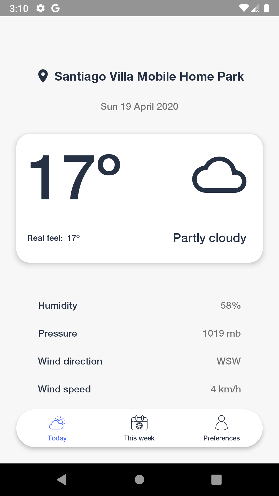
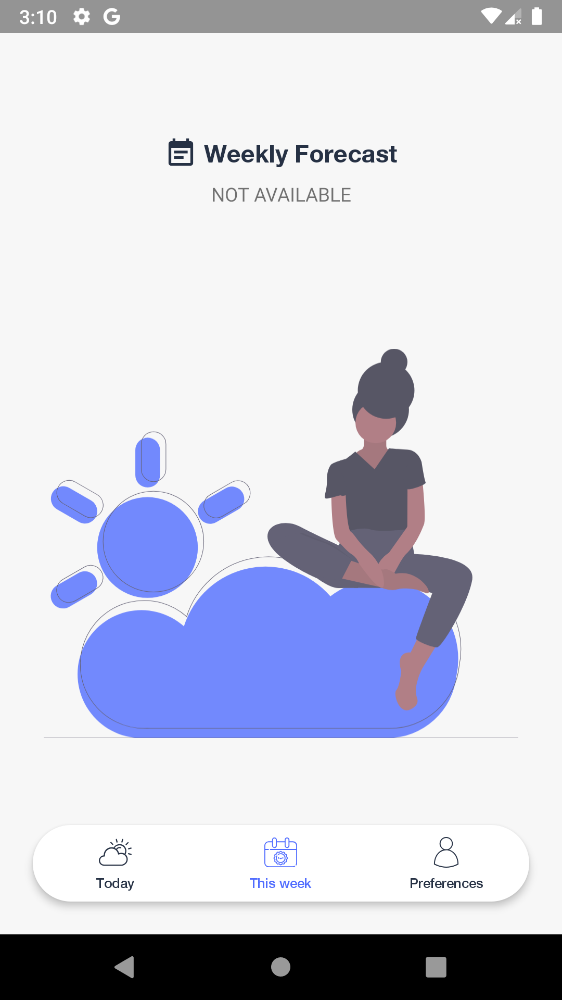
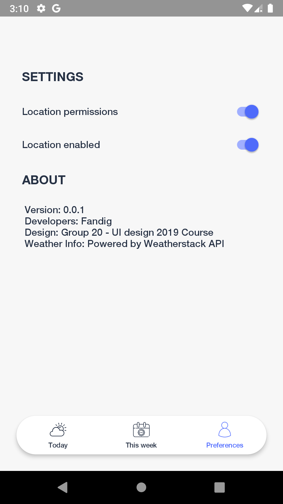

# Weather Forecast App
A simple weather forecast Android app.

The purpose of this project was to develop an Android application 
using the Kotlin programming language and to improve skills as an 
Android developer.

## Features
Request and display the weather information correspondig 
to the current user location.

## Weather API
The weather information is provided by the [World Weather Data API](https://weatherstack.com/)

## Results
|  |  ||
|----------|:-------------:|------:|

## Acquired knowledge
The development process involved learning the following topics:

- **Layouts:** Design custom layouts.

- **Data binding:** Allows to bind UI components in your layouts to data sources in your app.

- **Binding adapters:** Are responsible for making the appropriate framework calls to set values.

- **ViewModel:** Class for the UI controller that is responsible for preparing data for the UI.

- **LiveData:** An observable, lifecycle-aware data holder class.

- **MVVM architecture:** Best practices and recommended architecture pattern for building robust, production-quality apps.

- **Navigation:** Android Jetpack's Navigation component for consistent and predictable user experience.

- **Room database:** Persistence library that provides an abstraction layer over SQLite.

- **Retrofit:** A robust HTTP client to manage network requests.

- **SharedPreferences:** To store a small collection data.

- **FusedLocationProvider**: To access user's location

- **WorkManager:**  API to schedule deferrable, asynchronous tasks that are expected to run even if the app is closed. In this project, it's used to request the current weather from the API and send a notification to the user with a friendly message.

- **Dependency Injection:** Using Android **Hilt** library to implement dependency injection pattern.

- **Product flavors:** Build variants to create different versions of your app from a single project, for example, with different base API url.

- **DayNight Theme:** Support dark theme for Android 10 (API level 29) and higher.
